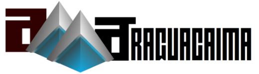

ToC
===
  * [Orpheus-DB](#orpheus-db)

Orpheus-DB
===

Utilities that helps to create and manage an orpheus db like structure for each table managed by JPA

* Orpheus-Db features and theory could be found [here](http://orpheus-db.github.io/)